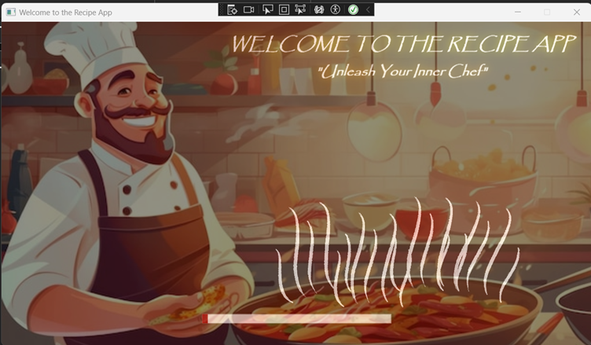
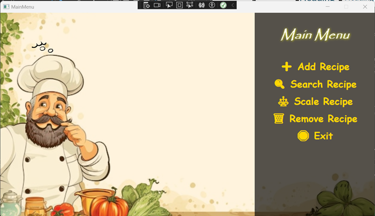
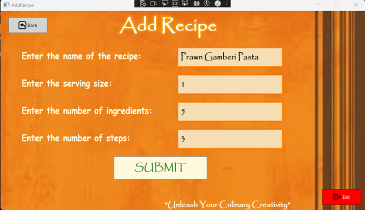
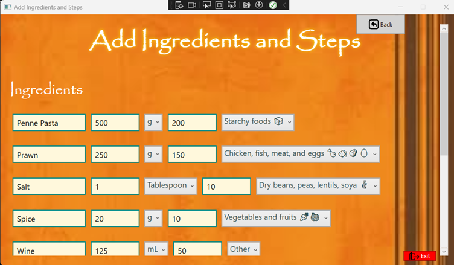
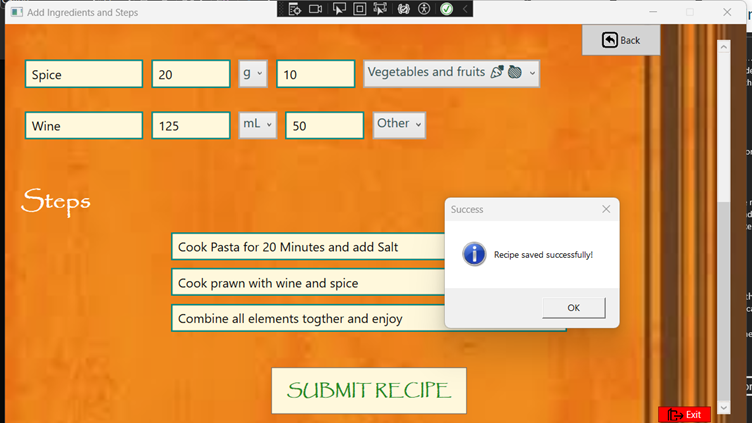
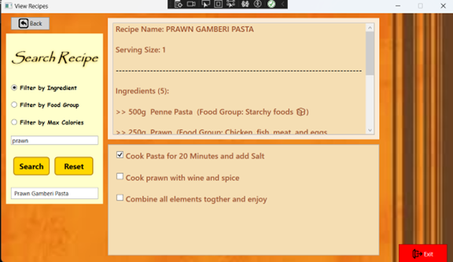
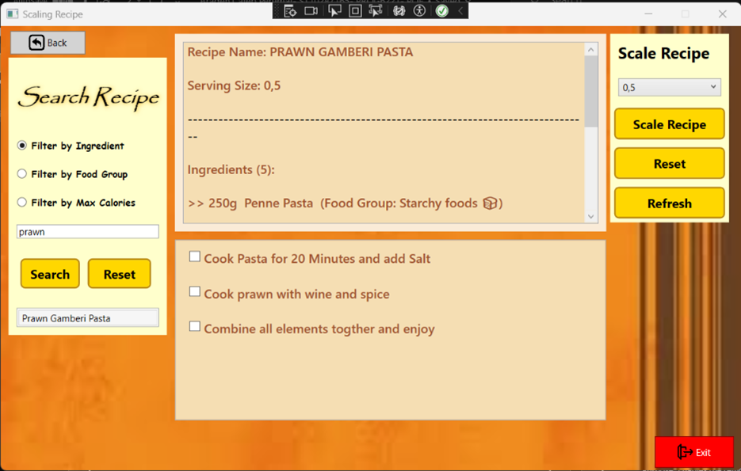
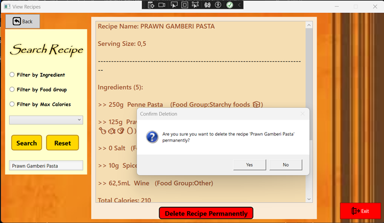
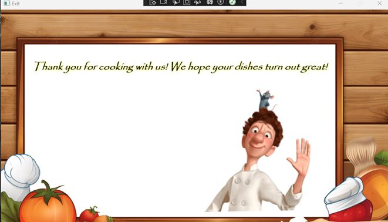

<div align="center">

# 🍽️📖 My Recipe App – WPF 🍽️📖


<h2></h2>

</div>

---
**Name:** Braden Caleb Perumal  
**Student Number:** ST10287165  

---

## 📚 Contents
1. [Introduction](#-introduction)  
2. [Requirements](#-requirements)  
3. [How to Apply](#-how-to-apply)  
4. [Application Overview](#-application-overview)
5. [How to Use & Screenshots](#-how-to-use--screenshots)
6. [Architecture](#-architecture)  
7. [Functionality](#-functionality)  
8. [Non-Functional Requirements](#-non-functional-requirements)  
9. [Change Log](#-change-log)  
10. [FAQs](#-faqs)  
11. [Licensing](#-licensing)  
12. [Plugins](#-plugins)  
13. [Credits](#-credits)  
14. [GitHub Link](#-github-link)  
15. [References](#-references)  

---

## Introduction
The **My Recipe App** has evolved into a **comprehensive WPF-based application**, enhancing user experience with a graphical interface while retaining its core functionalities such as **adding, viewing, scaling, and deleting recipes**.  
This version introduces an **interactive and visually appealing interface** complete with emojis and color-coded text, **streamlined ingredient management**, and **customizable recipes** for varying serving sizes — catering to both individual users and culinary enthusiasts seeking an efficient way to manage their recipes.

---

##  Requirements
### 🖥️ System Requirements
- **Operating System:** Windows 10 or later  
- **.NET Framework:** 4.7.2 or higher  
- **Minimum RAM:** 4 GB  
- **Processor:** Intel i3 or higher  
- **Disk Space:** At least 100 MB free  

### ⚙️ App Config (example)
```xml
<?xml version="1.0" encoding="utf-8" ?>
<configuration>
    <startup> 
        <supportedRuntime version="v4.0" sku=".NETFramework,Version=v4.6" />
    </startup>
</configuration>
```

---

## How to Apply
- ⬇️ **Download** the source code or **clone the repository**.  
- ▶️ **Launch** Microsoft Visual Studio IDE and open the solution.  
- 🛠 **Build** and **run** the program.  
- 🧭 Follow the on-screen instructions to **add**, **view**, **scale**, or **delete** recipes.

---

##  Application Overview
**Purpose:** Facilitate effective recipe management for users with features such as **adding**, **viewing**, **editing**, **deleting**, and **scaling** recipes.  
**Target Users:** Home cooks, chefs, and culinary enthusiasts.

### ⭐ Key Features
- 🍲 **Recipe Management** — create, edit, delete, and view recipes  
- 🧂 **Ingredient Handling** — quantities + units (ml, tbsp, kg, g, etc.)  
- 📈 **Recipe Scaling** — half, double, triple by servings or factor  
- 🧩 **Interactive Console/WPF Interface** — color, boxes, emojis  
- 🛡 **Built-in Validation** — cleaner inputs, fewer errors  
- 🔮 **Future-Ready** — groundwork for multi-recipe persistence & more

### 💎 Unique Selling Points
- **Engaging UI** (emojis, color, framed sections)  
- **One-click Scaling** for serving changes  
- **Input Validation** for robust user experience

---
## How to Use & Screenshots
This section combines **setup**, **usage**, and spaces for **screenshots + captions** you’ll add later.

### 🚀 Installation & First Run
1. **Download** the application setup file.  
2. **Locate** the file and double‑click to start installation.  
3. **Follow** the setup wizard (install directory, required disk space, shortcuts).  
4. Click **Finish**. Launch from **Desktop** icon or **Start menu**.

### 🧭 Using the App
### 🖼 Screenshots & Descriptions

---

**1️⃣ Welcome Screen**  
  
The app's welcome screen, which opens with a happy chef and a colourful kitchen background, sets the mood for a welcoming user experience. All of the primary functions, including **Add Recipe**, **Search Recipe**, **Scale Recipe**, **Remove Recipe**, and **Exit**, are easily accessible from the home screen.

---

**2️⃣ Main Menu**  
  
The main hub of navigation for the Recipe App. From here, users can access **Add Recipe**, **Search/View Recipe**, **Scale Recipe**, **Remove Recipe**, and **Exit**. The layout is designed for quick selection and user-friendly interaction.

---

**3️⃣ Add Recipe – Initial Entry**  
  
Purpose: Allows you to add new recipes to your personal database. The form captures recipe name, portion size, ingredient count, and number of steps. This structured process keeps recipe creation organised yet simple.

---

**4️⃣ Add Ingredients**  
  
Following the initial recipe setup, you can add each ingredient with its quantity, measurement unit (kg, L, etc.), and calorie count. The system supports dietary group classification to enhance nutritional tracking.

---

**5️⃣ Add Steps**  
  
Enter each cooking instruction step-by-step, ensuring they are clear and easy to follow. This method supports sequential entry to maintain proper preparation order.

---

**6️⃣ Search/View Recipe**  
  
Purpose: Quickly locate recipes by name, ingredient, or calorie count. The search results list allows you to select a recipe to see full details.

---

**7️⃣ Scale Recipe**  
  
Purpose: Adjust recipe quantities by changing servings or applying a multiplication factor. Ingredient amounts are automatically recalculated to match the new serving size.

---

**8️⃣ Remove Recipe**  
  
Purpose: Permanently delete recipes from your database. You can filter to locate the recipe before deletion. Includes confirmation to prevent accidental removal.

---

**9️⃣ Exit Application**  
  
Safely close the program ensuring no unsaved work is lost. The Exit function ensures smooth shutdown without data corruption. Every screen also provides **Back** and **Exit** buttons for quick navigation.

---
##  Architecture
The app follows a **simplified MVC-like pattern**:
- **Models:** `Recipe`, `Ingredients`, `ScalingRecipe`  
- **Controller:** `RecipeFunctions`  
- **View:** Console/WPF UI  

While not a strict MVC implementation, responsibilities are separated: **models** hold data, **controller** manages logic & flow, and the **view** renders interactions.  
**Future improvements**: persistence (DB/files), dependency injection, and clearer MVVM/MVC separation.

---

## Functionality
- 🧾 **Single recipe entry** (focused, simple data capture)  
- 👀 **Detailed display** (ingredients, units, steps)  
- 🔀 **Scaling** by ×2 / ×3 / ×5 or custom factor  
- ↩️ **Revert** back to original quantities  
- 🗑 **Delete & start new** quickly  
- 🧠 **In-memory storage** (session-only, no persistence yet)

---

##  Non-Functional Requirements
- ✅ **Coding standards** (naming, structure, comments)  
- 🧱 **Object-oriented** design (classes encapsulate behavior/data)  
- 🧾 **Lists/Collections** for dynamic, flexible data handling

---

##  Change Log
### ➡️ Transition: Part 1 → Part 2
- **Multiple Recipe Management:** from single → multiple recipes  
- **Alphabetical Sorting:** easier navigation  
- **Nutritional Tracking:** per ingredient  
- **Calorie Alerts:** highlight > 300 kcal (configurable)  
- **UI Enhancements:** more interactive feedback  
- **Technical:** moved from arrays to `List<T>`; added **unit tests**

### ➡️ Transition: Part 2 → Part 3 (Current)
- **WPF + MVVM:** richer UI & data binding  
- **Graphical Overhaul:** forms/controls for add/view/scale  
- **Persistence Ready:** groundwork for DB/file storage  
- **Accessibility & Customization:** themes, fonts, layouts  
- **Error Handling & Validation:** more robust, clearer feedback

---

##  FAQs
**Q1:** What should I do if I encounter an error during recipe input?  
**A1:** Ensure quantities are numeric and units match available options. If issues persist, restart the app to clear transient input errors.

**Q2:** How can I print recipe details to share with others?  
**A2:** Current version lacks direct print. Copy the details into a text editor/Word and print from there.

**Q3:** Is there a way to back up my recipes before closing the application?  
**A3:** Data is not persistent yet. Manually save key recipes to a separate document for now.

**Q4:** The application is unresponsive. What should I do?  
**A4:** Close and reopen the app. If it continues, check Task Manager for interfering background processes.

**Q5:** Can I add photos to my recipes?  
**A5:** Not yet in console/WPF version. Consider keeping photos in a separate recipe book.

**Q6:** How do I update or check for updates?  
**A6:** Check the GitHub repository for new releases and replace your app files as needed.

**Q7:** I found a bug — how do I report it?  
**A7:** Open a GitHub issue with steps to reproduce and, if possible, screenshots.

**Q8:** Are there keyboard shortcuts?  
**A8:** Not currently; menu-driven navigation is used.

**Q9:** The app won’t start.  
**A9:** Ensure **.NET 4.7.2+** is installed and the solution builds without errors.

---

## Licensing
**MIT License** — free to use, modify, and distribute with attribution.  
MIT is permissive and simple. If you prefer copyleft, consider GPL; for commercial restrictions, explore commercial licensing.

---

## Plugins
No external plugins; fully integrated codebase.

---

##  Credits
Developed and tested by **Braden Caleb Perumal (ST10287165)**.

---

## GitHub Link
🔗 https://github.com/VCWVL/prog6221---programming-2a---poe-CalebPerumal28.git

---

## References
- **BroCode**, _C# Full Course for free_.  
  https://www.youtube.com/watch?v=wxznTygnRfQ&t=10600s&ab_channel=BroCode  
- **BroCode**, _C# tutorial for beginners_.  
  https://www.youtube.com/watch?v=r3CExhZgZV8&list=PLZPZq0r_RZOPNy28FDBys3GVP2LiaIyP_&ab_channel=BroCode  
- **Christensen, M.**, _Creating a List of Lists in C#_.  
  https://stackoverflow.com/questions/12628222/creating-a-list-of-lists-in-c-sharp  
- **GeeksforGeeks**, _C# | Constructors_.  
  https://www.geeksforgeeks.org/c-sharp-constructors/  
- **Slayden, G.**, _How to convert emoticons to its UTF-32/escaped unicode?_.  
  https://stackoverflow.com/questions/44728740/how-to-convert-emoticons-to-its-utf-32-escaped-unicode  

---


